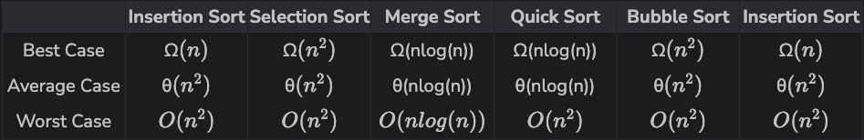

## Overview of Sorting Algorithms
> Here's a quick summary of the time complexity of sorting algorithms.

Now that we’ve gone over how most famous and important sorting algorithms work, here’s a quick table that you can refer to when you are solving coding problems.
