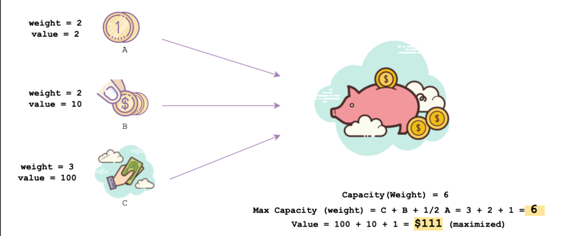
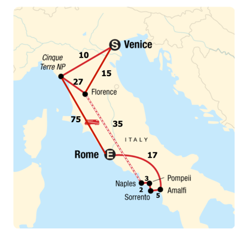

# Greedy Approach: A Deep Dive

> Greedy algorithms
> 
> **Greedy** is an algorithmic paradigm in which the solution is built piece by piece. 
> The next piece that offers the most obvious and immediate benefit is chosen. 
> The greedy approach will always make the choice that will maximize the profit and minimize the cost at any given point. 
> It means that a locally-optimal choice is made in the hope that it will lead to a globally-optimal solution.

## A real life example

Imagine you just got a new piggy bank to save some money for your college admission. 
The bank is small and can only contain a fixed weight. 
Each item can only be added once. 
You’ve got to be smart and choose the maximum value vs weight ratio for putting anything into it.

This is also called the fractional knapsack problem. 
The local optimal strategy is to choose the item that has maximum value vs weight ratio. 
This strategy also leads to a globally-optimal solution because we are allowed to take fractions of an item.

## How to make the optimal choice

> The Greedy algorithm has only one shot to compute the optimal solution. It can never go back and reverse the decision. Hence, the algorithm makes greedy choices at each step to ensure that the objective function is 
optimized.

## Shortest path finding problem

In order to understand the un-optimized solution issue, consider the following shortest path finding problem:

Look at the figure above, where you have to travel the minimum distance from the starting point Venice(S) to the ending point Rome(E).

You are given the distance values respective to each path. Your goal is to minimize this (distance) value from S−>E .

Following the greedy approach, you will first pick the minimum choice available at the starting point. So, the path would look like:

> Venice -> Cinque Terre NPCost = 10

Next, we have 2 options available:

> Cinque Terre NP -> RomeCost = 75
> 
> Cinque Terre NP -> FlorenceCost = 27

Following the greedy approach, we will have to take the path with the least cost i.e 27
. So now, we have covered:

> Venice -> Cinque Terre NP -> Florence Cost = 10 + 27 = 37

At Florence, we have only one option to go forward, via Naples, then to Sorrento to Amalfi to Pompeii and finally, Rome.

Hence,

> Venice -> CinqueTerreNP -> Florence -> Naples -> Sorrento -> Amalfi -> 
> Pompeii -> Rome

Even though, we can easily spot that instead of taking that first smallest step costing 10 , if we go to Venice -> Florence, which costs 
15, the whole trip will cost 77!

> Venice -> Florence -> Naples -> Sorrento -> Amalfi -> Pompeii -> Rome
> Cost = 15 + 35 + 2 + 3 + 5 + 17 = 77

---

Thus, it can be concluded that sometimes, the greedy algorithm fails to find the globally-optimal solution because it does not consider all the data. However, there are many implementations (like Dijkstra’s & Kruskal’s algorithms) of this approach that we will look into, further in this chapter.

## Observation about greedy approach#
Greedy algorithms have some advantages and disadvantages.

### Advantages
* **Easy to devise:** It is easier to come up with a greedy approach (or even multiple greedy algorithms) for a single problem than computing solutions via other ways like binary search, dynamic or functional programming.
* **Compute the running time complexity:** Analyzing the run time for greedy algorithms will generally be simpler than other techniques like traversals of trees, graph algorithms or divide & conquer. For the divide and conquer method, it is not clear whether the technique is fast
 or slow ? It is because, at each recursion call, the size of the problem shrinks, while the number of subproblems increases.

### Disadvantages
* **Un-optimized solution:** One of the major disadvantages of the ‘greedy’ approach is that initially, you might take a smaller step that leads to one big step that costs the maximum. And hence, the final solution can never be optimized. (Explained in the example above.)

* **Proof of correctness:** For greedy algorithms, it is harder to understand the correctness issues of a solution. Even with the correct algorithm, it is hard to prove why it is correct. While proving the correctness of a greedy algorithm, it requires a good deal of effort and patience. Moreover, the methods like proof of correctness via contradiction are used for this purpose.

