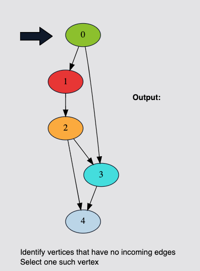

# Topological Sorting of a Graph

## Problem Statement
Imagine you have been given the task to schedule some tasks. The tasks are represented as vertices of the graph, and if a task
u must be completed before a task v can be started, then there is an edge from u to v in the graph.

Find the order of the tasks so that each task can be performed in the right order.

This problem can be solved if we find the topological sorting of the graph.


### What is Topological Sort of a Graph?
A topological sort gives the order in which to perform the tasks.

Topological sorting for Directed Acyclic Graph (DAG) is a linear ordering of vertices. For every directed edge
{u,v} vertex u comes before v in the ordering.

> Topological sorting for a graph is not possible if the graph is not a DAG.

The algorithm for topological sorting can be visualized as follows:




Implement a function that takes a Directed Acyclic Graph (DAG) and returns a topologically sorted list of nodes for that graph.


## Input
A variable `testVariable` containing the Directed Acyclic Graph.

## Output
A list containing the topological sorting of that graph.


## Sample Input
```
testVariable = {0 -> 1
                0 -> 3
                1 -> 2
                2 -> 3
                2 -> 4
                3 -> 4}
```


## Sample Output
```
[0, 1, 2, 3, 4]
```